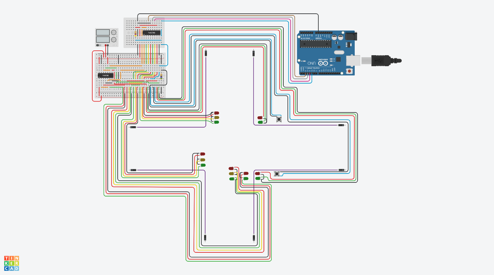
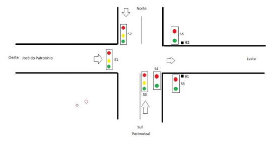

# Semáforo

>
>Trabalho de Tópicos em Tecnologias - ADS3002D (UCS - Universidade de Caxias do Sul)
>

**Aluno:** Rafael Rossa 
**Instituição:** Universidade de Caxias do Sul 
**Curso:** Bacharelado em Ciência da Computação 
**Disciplina:** Tópicos em Tecnologias 
**Professor:** Ricardo Vargas Dorneles 
**Implementado em C**

**Fórum: <a href="https://bomrafinha.dev/topicos-em-tecnologias-semaforo/" target="_blank">https://bomrafinha.dev/topicos-em-tecnologias-semaforo/</a>**  

***Clique na Imagem para visualizar o vídeo***  

## Simulação de Semáforo

### Objetivo do Trabalho

Desenvolver um programa em C que realize em um Arduino (físico ou no Tinkercad) a simulação do funcionamento de um controlador de semáforos da esquina da Rua José do Patrocínio com a Av. Perimetral, mostrada no esquema abaixo:

O semáforo S1 controla o fluxo na José do Patrocínio (é uma rua de mão única). Os carros vindos da José do Patrocínio podem seguir em frente ou dobrar à direita ou esquerda da Av. Perimetral.

Os semáforos S2 e S3 controlam o fluxo em frente nos dois sentidos da Perimetral. Eles não permitem conversão para a José do Patrocínio.

O semáforo S4 permite a conversão à direita para a José do Patrocínio.

Os semáforos S5 e S6 são para pedestres.

Os botões B1 e B2 solicitam a ativação dos semáforos S5 e S6.

A sequência de estados é a seguinte:

1. A simulação inicia com a sinaleira S1 em verde durante 10 segundos. Todas as outras sinaleiras estão em vermelho.
2. S1 vai para amarelo e permanece por 3 segundos.
3. S1 vai para vermelho durante 15 segundos e S2 e S3 vão para verde durante 12 segundos, após o qual vão para amarelo por 3 segundos. S4 vai para verde durante 10 segundos, após o qual, se alguém apertou o botão B1 ou B2, S4 vai para vermelho, e S5 e S6 vão para verde durante 5 segundos. Se ninguém apertou o botão, S4 continua verde até completar os 15 segundos.
4. S1 vai para verde e todas as outras vão para vermelho, reiniciando o ciclo no estado 1. O controle dos semáforos deve ser feito através de shift registers 74HC595, de modo que 3 pinos sejam suficientes para controlar todos os semáforos.

 

## Créditos 
[@bomrafinha](https://github.com/bomrafinha)

## [Licença](./LICENSE) 
